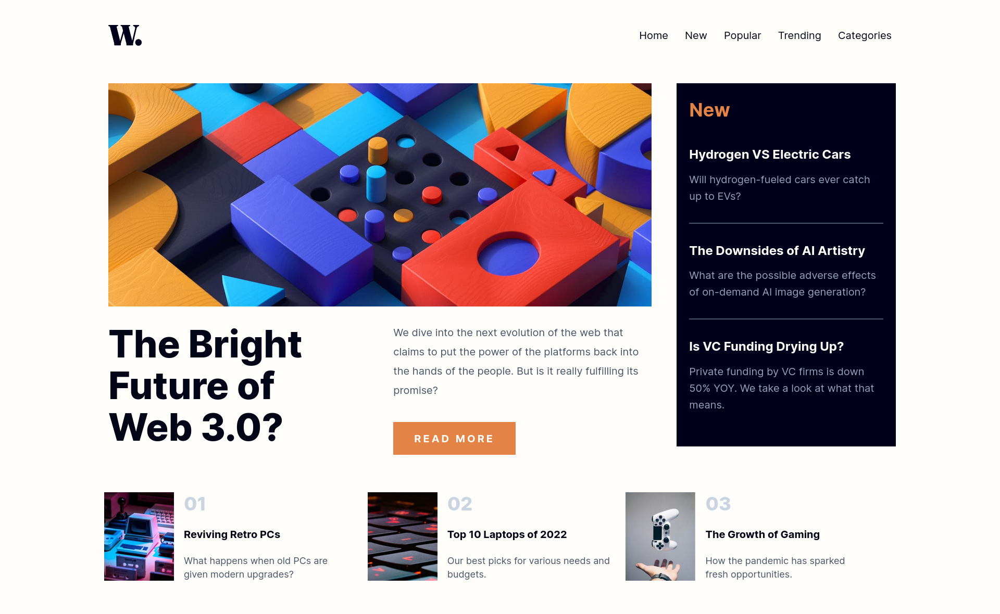

# Frontend Mentor - News homepage solution

This is a solution to the [News homepage challenge on Frontend Mentor](https://www.frontendmentor.io/challenges/news-homepage-H6SWTa1MFl). Frontend Mentor challenges help you improve your coding skills by building realistic projects.

## Table of contents

- [Overview](#overview)
  - [The challenge](#the-challenge)
  - [Screenshot](#screenshot)
  - [Links](#links)
- [Author](#author)

## Overview

### The challenge

Users should be able to:

- View the optimal layout for the interface depending on their device's screen size
- See hover and focus states for all interactive elements on the page

### Screenshot

### Links

- Solution URL: [GitHub repo](https://github.com/amine-boukhris/front-end-mentor-challenges)
<!-- - Live Site URL: [Add live site URL here](https://your-live-site-url.com) -->

## Author

- Website - [Portfolio](https://amine-portfolio-seven.vercel.app/)
- Frontend Mentor - [@amine-boukhris](https://www.frontendmentor.io/profile/amine-boukhris)
- Twitter - [@AminBoukhris1](https://twitter.com/AminBoukhris1)
- Email - boukhrisamine210@gmail.com
